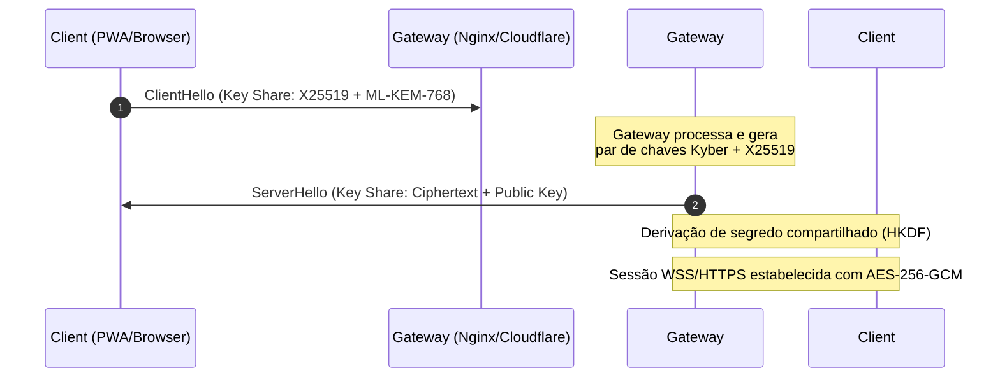
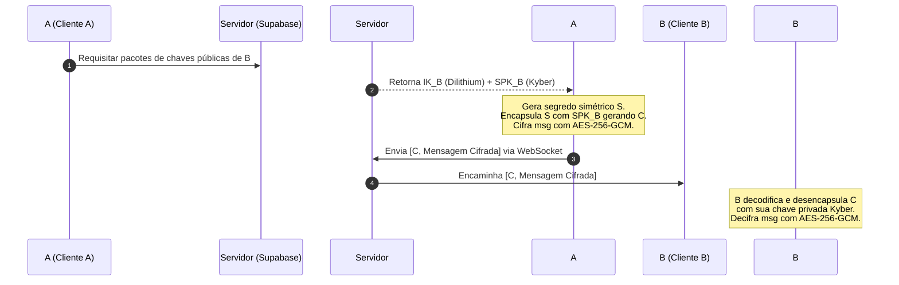

# Especificação de Arquitetura de Segurança Pós-Quântica (PQ) — UndoinG

Esta especificação técnica detalha o design arquitetural para blindar a plataforma **UndoinG** (`www.undoing.com.br`) contra ataques baseados em computadores quânticos capazes de quebrar algoritmos assimétricos tradicionais (RSA, Diffie-Hellman, ECDSA, ECDHE).

---

## 1. Troca de Chaves Híbrida Pós-Quântica no TLS (KEM)

Para proteger o tráfego HTTP/S e as conexões em tempo real por WebSockets (WSS) contra a ameaça do tipo **"Store Now, Decrypt Later"** (onde adversários interceptam e armazenam dados criptografados hoje para decifrá-los no futuro usando um computador quântico), implementamos um esquema de troca de chaves híbrido.

### 1.1 O Algoritmo Híbrido: X25519 + ML-KEM (Kyber)
Combinamos o algoritmo clássico de curva elíptica **X25519** com o mecanismo de encapsulamento de chaves (KEM) pós-quântico estruturado em reticulados **Kyber-768 (ML-KEM-768)**, padronizado pelo NIST.
- **Segurança Clássica:** X25519 garante conformidade com padrões e proteção contra possíveis falhas matemáticas descobertas no Kyber.
- **Segurança Pós-Quântica:** ML-KEM fornece segurança de 128 bits contra ataques quânticos baseados no algoritmo de Shor.

### 1.2 Fluxo de Negociação de Chaves (TLS 1.3)
No TLS 1.3, o aperto de mão (handshake) é executado em uma única ida e volta (1-RTT):



### 1.3 Configuração do Servidor (Nginx com OpenSSL 3.2+ e OQS Provider)
Para habilitar o grupo híbrido `x25519_kyber768` no Nginx, o servidor deve ser compilado com a biblioteca **liboqs** e o **oqs-provider** para OpenSSL.

Diretivas do arquivo de configuração do Nginx (`nginx.conf`):
```nginx
ssl_protocols TLSv1.3;
# Força o uso do grupo de troca de chaves híbrido pós-quântico
ssl_ecdh_curves x25519_kyber768:x25519:secp256r1;
ssl_ciphers TLS_AES_256_GCM_SHA384:TLS_CHACHA20_POLY1305_SHA256;
ssl_prefer_server_ciphers on;
```

*Nota para Cloudflare:* Se a plataforma UndoinG utilizar a Cloudflare como proxy de borda, basta ativar a opção **"Post-Quantum Cryptography"** no menu *Security > SSL/TLS > Edge Certificates*, permitindo negociação automática do grupo `X25519Kyber768Draft00`.

---

## 2. Assinaturas Digitais Pós-Quânticas para Tokens JWT (ML-DSA)

Os tokens de sessão gerados pelo Supabase GoTrue e validados pelo Gateway Go usam tradicionalmente assinaturas assimétricas clássicas. Para blindar os tokens de sessão contra falsificação (forgery) no Gateway, introduzimos uma camada de assinatura dupla (Dual-Signing) combinando **RS256/ES256** com o algoritmo pós-quântico **ML-DSA-65 (Dilithium-3)**.

### 2.1 Estrutura do Token JWT Híbrido
O JWT estendido contém a assinatura clássica e a assinatura pós-quântica encapsulada em um cabeçalho customizado (`x-pq-sig`):

```json
{
  "header": {
    "alg": "RS256",
    "typ": "JWT",
    "x-pq-alg": "ML-DSA-65",
    "x-pq-sig": "MIIB...[Assinatura Dilithium em Base64]..."
  },
  "payload": {
    "sub": "d02b9a89-5120-4f2a-a177-5d50e87ef2fd",
    "username": "usuario_teste",
    "role": "authenticated",
    "exp": 1781498400
  }
}
```

### 2.2 Algoritmo de Verificação no Gateway Go

O Gateway em Go intercepta o JWT, faz a verificação convencional e executa a decodificação da assinatura pós-quântica usando a biblioteca Cgo vinculada ao `liboqs`:

```go
// Exemplo conceitual do parser no Gateway
func VerifyPQToken(tokenString string, classicalKey any, pqPublicKey []byte) (*Claims, error) {
    // 1. Validação Clássica
    token, err := jwt.Parse(tokenString, func(t *jwt.Token) (interface{}, error) {
        return classicalKey, nil
    })
    if err != nil || !token.Valid {
        return nil, errors.New("classical validation failed")
    }

    // 2. Extração da Assinatura Pós-Quântica (Dilithium)
    claims := token.Claims.(jwt.MapClaims)
    pqSigB64 := token.Header["x-pq-sig"].(string)
    pqSig, _ := base64.StdEncoding.DecodeString(pqSigB64)

    // Reconstrói a mensagem assinada (header + "." + payload)
    parts := strings.Split(tokenString, ".")
    messageToVerify := []byte(parts[0] + "." + parts[1])

    // Verifica assinatura ML-DSA-65
    isValidPQ := mldsa.Verify(messageToVerify, pqSig, pqPublicKey)
    if !isValidPQ {
        return nil, errors.New("post-quantum signature validation failed")
    }

    return claims, nil
}
```

---

## 3. Criptografia de Ponta a Ponta (E2EE) no Chat (PQ-Signal)

O tráfego de mensagens em tempo real da UndoinG deve ser protegido por criptografia ponta a ponta (E2EE) de nível militar. Adaptamos o **Protocolo Signal** substituindo as trocas Diffie-Hellman por mecanismos baseados em reticulados pós-quânticos.

### 3.1 O Protocolo PQ-X3DH (Extended Triple Diffie-Hellman Pós-Quântico)
Para estabelecer a chave simétrica inicial sem que um atacante passivo consiga interceptá-la ou falsificá-la, usamos chaves públicas persistentes e efêmeras. O protocolo substitui o DH pelo encapsulamento **ML-KEM (Kyber)**:

1. **Geração de Chaves:** Cada cliente gera chaves de Identidade (IK) com **ML-DSA-65** e um pool de chaves de pré-assinatura (SPK) e chaves efêmeras (OPK) com **ML-KEM-768**, registrando-os no servidor (Supabase).
2. **Encapsulamento de Chave:** Quando o Usuário A quer enviar uma mensagem para o Usuário B:
   - O Usuário A baixa o pacote de chaves públicas de B (IK_B, SPK_B, OPK_B).
   - O Usuário A gera um segredo simétrico $S$ de 256 bits.
   - O Usuário A encapsula o segredo usando Kyber para gerar o texto cifrado $C$.
   - A chave simétrica final é derivada combinando $S$ com chaves adicionais via KDF.
   - O Usuário A envia $C$ e a primeira mensagem criptografada (com AES-256-GCM) via WebSocket para B.
3. **Desencapsulamento:** O Usuário B recebe o texto cifrado $C$, usa sua chave privada Kyber correspondente para desencapsular $S$, reconstrói a chave simétrica e decifra a mensagem.



### 3.2 Double Ratchet Pós-Quântico
Para garantir o **Forward Secrecy** (segredo adiante) e a **Post-Compromise Security** (segurança pós-comprometimento), a cada nova ida e volta de mensagens, as chaves simétricas de criptografia são rotacionadas.
- O **Ratchet KDF Simétrico** (derivado de funções Hash SHA-256) é mantido.
- O **Ratchet Assecional (Diffie-Hellman)** é substituído por um **Ratchet de Encapsulamento Kyber (ML-KEM)**: o remetente envia uma nova chave pública efêmera Kyber em cada cabeçalho de mensagem, e o receptor encapsula uma nova chave de sessão para responder, zerando chaves passadas da memória imediatamente após a decodificação.

---

## 4. Proteção de Dados em Repouso e Backups

A persistência de dados sensíveis da rede social no banco PostgreSQL do Supabase e nos Storages de mídias (AWS S3) é blindada com **AES-256-GCM**. No entanto, a proteção da chave mestra de criptografia (Master Key) é gerida sob um modelo distribuído e pós-quântico.

### 4.1 Proteção da Chave Mestra com Shamir's Secret Sharing (SSS) Pós-Quântico
A Chave Mestra de Criptografia do Banco de Dados não reside em um único servidor ou arquivo de texto claro. Ela é dividida em $N$ fragmentos criptográficos usando o algoritmo de compartilhamento de segredos de Shamir (limiar $(k, n)$ onde $k$ partes são necessárias para restaurar a chave).

Para garantir que a comunicação e transporte destes fragmentos sejam invulneráveis a interceptações de computadores quânticos:
1. Cada nó responsável por armazenar um fragmento possui um par de chaves **ML-KEM-768**.
2. Quando o banco de dados precisa ser montado/reiniciado, os nós gerenciam a validação de identidade via assinaturas **ML-DSA** e trocam segredos encapsulados com **ML-KEM**.
3. Uma vez atingido o quórum de $k$ nós ativos, a chave de criptografia do banco de dados PostgreSQL é reconstruída diretamente na memória volátil (RAM) e nunca gravada em disco.

### 4.2 Criptografia de Arquivos no AWS S3 / Cloudinary
Arquivos de mídia (imagens de posts, mensagens temporárias de voz, etc.) são criptografados no cliente antes do upload usando chaves de criptografia derivadas do canal de chat dos envolvidos. Para arquivos globais, é utilizado o envelope digital do AWS KMS integrado com suporte a algoritmos pós-quânticos (como as chaves geridas via algoritmo pós-quântico de curva elíptica híbrido).

---

## 5. Suíte de Testes de Validação Contínua (QE e Ofensiva)

Para garantir que a implementação criptográfica permaneça resiliente, implementamos uma suíte de testes de validação contínua composta por:
1. **Testes de Módulo (Go):** Validação unitária e benchmarks do ML-DSA-65 e ML-KEM-768 no pacote shared.
2. **Integração Supabase:** Testes de persistência de chaves e rollback transacional caso a verificação PQC falhe.
3. **End-to-End (Playwright):** Simulação real do ciclo de vida das chaves e do chat cifrado no navegador.
4. **Carga e Estresse (k6):** Validação de latência e consumo de CPU sob volumetria simultânea.
5. **Segurança Ofensiva:** Testes simulados de replay de tokens, colisões de chaves e injeção de scripts (XSS/SQL) no tráfego protegido.

